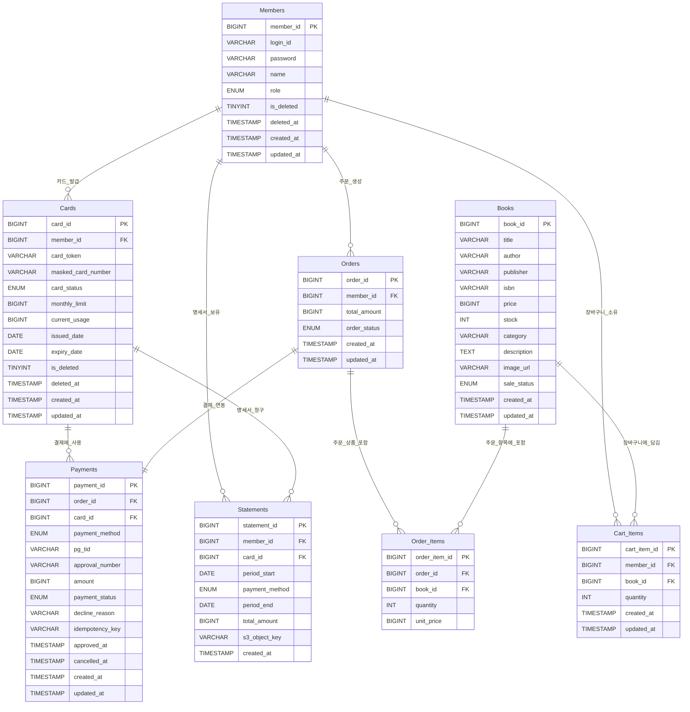

# **ERD (Entity-Relationship Diagram)**

```mermaid
erDiagram
    Members ||--o{ Cards : "카드_발급"

    Members ||--o{ Orders : "주문_생성"
    Members ||--o{ Statements : "명세서_보유"
    Members ||--o{ Cart_Items : "장바구니_소유"
    Cards ||--o{ Payments : "결제에_사용"
    Cards ||--o{ Statements : "명세서_청구"

    Orders ||--o{ Order_Items : "주문_상품_포함"
    Orders ||--|| Payments : "결제_연동"
    Books ||--o{ Order_Items : "주문_항목에_포함"
    Books ||--o{ Cart_Items : "장바구니에_담김"

    Members {
        BIGINT member_id PK
        VARCHAR login_id
        VARCHAR password
        VARCHAR name
        ENUM role
        TINYINT is_deleted
        TIMESTAMP deleted_at
        TIMESTAMP created_at
        TIMESTAMP updated_at
    }

    Cards {
        BIGINT card_id PK
        BIGINT member_id FK
        VARCHAR card_token
        VARCHAR masked_card_number
        ENUM card_status
        BIGINT monthly_limit
        BIGINT current_usage
        DATE issued_date
        DATE expiry_date
        TINYINT is_deleted
        TIMESTAMP deleted_at
        TIMESTAMP created_at
        TIMESTAMP updated_at
    }


    Payments {
        BIGINT payment_id PK
        BIGINT order_id FK
        BIGINT card_id FK

        ENUM payment_method
        VARCHAR pg_tid
        VARCHAR approval_number
        BIGINT amount
        ENUM payment_status
        VARCHAR decline_reason
        VARCHAR idempotency_key
        TIMESTAMP approved_at
        TIMESTAMP cancelled_at
        TIMESTAMP created_at
        TIMESTAMP updated_at
    }

    Statements {
        BIGINT statement_id PK
        BIGINT member_id FK
        BIGINT card_id FK
        DATE period_start
        ENUM payment_method
        DATE period_end
        BIGINT total_amount
        VARCHAR s3_object_key
        TIMESTAMP created_at
    }

    Books {
        BIGINT book_id PK
        VARCHAR title
        VARCHAR author
        VARCHAR publisher
        VARCHAR isbn
        BIGINT price
        INT stock
        VARCHAR category
        TEXT description
        VARCHAR image_url
        ENUM sale_status
        TIMESTAMP created_at
        TIMESTAMP updated_at
    }

    Orders {
        BIGINT order_id PK
        BIGINT member_id FK
        BIGINT total_amount
        ENUM order_status
        TIMESTAMP created_at
        TIMESTAMP updated_at
    }

    Order_Items {
        BIGINT order_item_id PK
        BIGINT order_id FK
        BIGINT book_id FK
        INT quantity
        BIGINT unit_price
    }

    Cart_Items {
        BIGINT cart_item_id PK
        BIGINT member_id FK
        BIGINT book_id FK
        INT quantity
        TIMESTAMP created_at
        TIMESTAMP updated_at
    }
```
